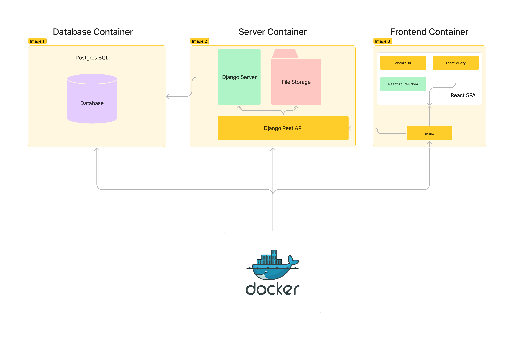
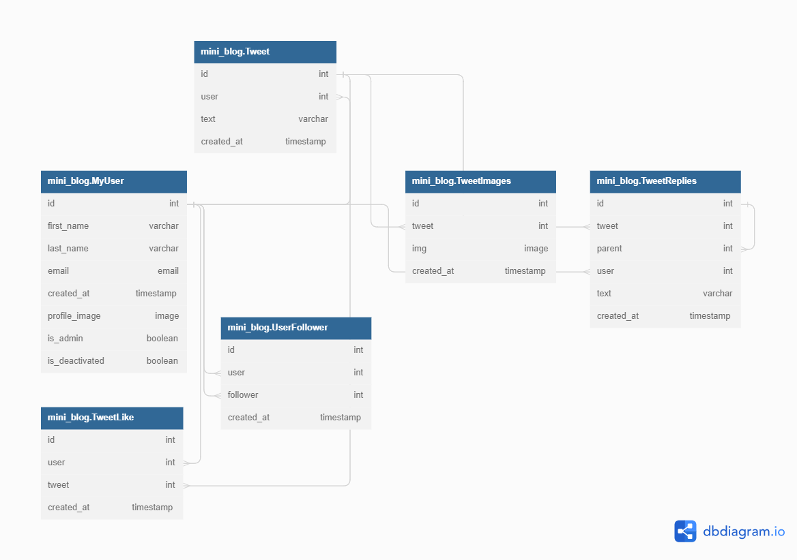

# System Design of Mini-BLOG

## Overall System Design

### Database Container

Postgres sql is choosen for this solution as a relational database solution. We will have multiple table to store users, tweet, like, followers etc and using relational database will help us to get the desire form of data using joining approach with the help of primary and secondary key. All of data we are getting in this application will be the structured data.

### Server Container

Server is build with django and django-rest-api which are the framework of python for building web application and rest-api simultaneously. Django help us to build secure and scalable server providing in built security. Django rest framework provide quick way to build rest api from django. Currently file is stored inside the file location in django server. Django rest api will store and retrive images from the server.

### Frontend Container

Frontend is build with reactjs and server with nginx. Chakra ui is used as a styling library and react-query is used for the networking along with axios. React router dom is used for routing.

## Databse Design

## API

API is documented using postman in json format [click here to see] (api.json)

## Advantages and Disadvantages

Django, PostgreSQL, and React are a popular combination for building web applications. Each technology has its own advantages and disadvantages, which we can consider from the following points:

- Scalability:
  Advantages: Django's modular design and support for horizontal scaling make it a great choice for building scalable applications. PostgreSQL's ability to handle large datasets and complex queries can also contribute to scalability. React's component-based architecture makes it easier to manage complex UI components and optimize performance.
  Disadvantages: Scaling a Django application can be complex, and requires careful consideration of the database and application architecture. React can also be challenging to scale, as managing state across a large number of components can be difficult.

- Cost performance:
  Advantages: Django, PostgreSQL, and React are all open source technologies, which can help reduce costs associated with licensing and maintenance. They also have active developer communities, which means that there are plenty of resources available for support and troubleshooting.
  Disadvantages: Although the technologies themselves are free, building a web application with Django, PostgreSQL, and React requires a significant investment of time and resources. Additionally, scaling the application can require additional hardware and infrastructure costs.

- Availability:
  Advantages: Django's built-in support for caching and PostgreSQL's ability to handle high traffic make both technologies great choices for building highly available applications. React's ability to efficiently render UI components can also help improve application availability.
  Disadvantages: Availability can be impacted by a variety of factors, including network connectivity, hardware failures, and software bugs. Careful monitoring and testing are required to ensure that the application is always available to users.

- Maintainability:
  Advantages: Django's modular design and clear separation of concerns can make it easier to maintain and update applications over time. PostgreSQL's support for transactions and data integrity can also help ensure that the database remains reliable and easy to maintain. React's component-based architecture can help make it easier to update UI components without affecting the rest of the application.
  Disadvantages: Maintaining a complex web application requires ongoing effort and resources. This can include debugging, testing, and updating code, as well as ensuring that the application remains secure and compliant with industry standards.

- Extensibility:
  Advantages: Django's modular design and support for plugins and third-party libraries can make it easier to extend the functionality of an application over time. PostgreSQL's support for complex data types and user-defined functions can also make it easier to add new features. React's component-based architecture can make it easier to add new UI components and customize the user interface.
  Disadvantages: Extending a complex web application can be challenging, and requires careful consideration of the existing architecture and codebase. Poorly designed extensions can introduce bugs and security vulnerabilities, and may also impact performance and scalability.

## Operations

- Security Vulnerabity as we are using token authentication which can cause XSS attack
- Taking long time to load the homepage of the user
- like and replies aren't updating on real time and user need to manually refresh the page

## Future enhancements

- Implementing socket to update like and replies in realtime
- Adding machanism to create user feed in advance impelenting im memory with redis to update the feed page when ever new user create tweet
- Implement the session authentication in place of the token authentication to better improve security features
- Impementing kubernates for orchestration and better resource management
- improving better user interface and better user experience design
